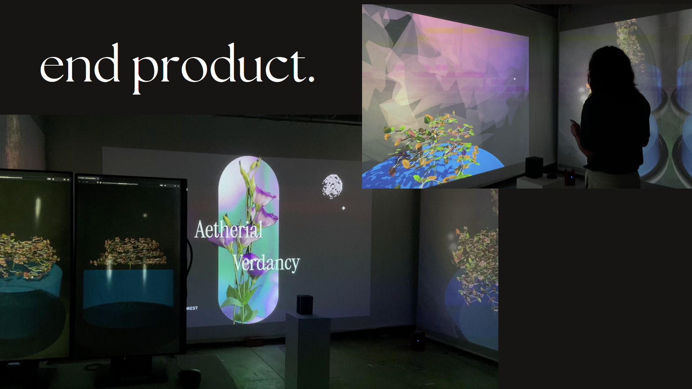
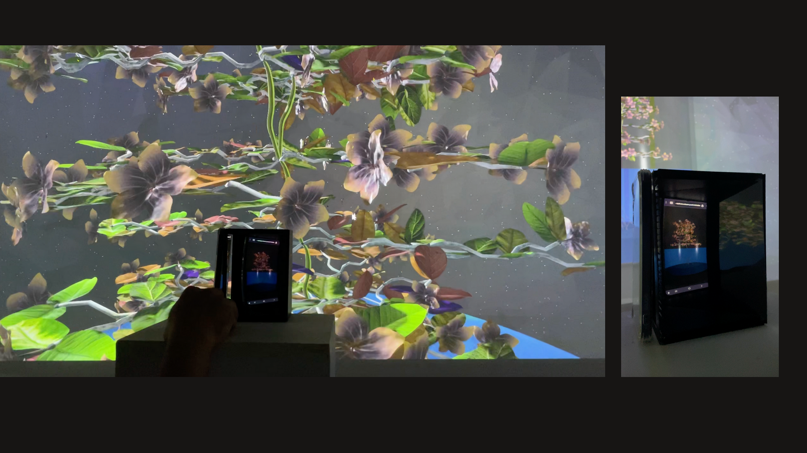
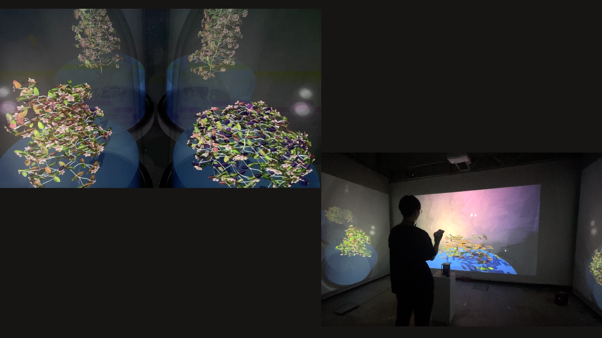

# Aetherial Verdancy

In a future where Earth faces extreme overpopulation, the challenge of sustainable food production has grown more pressing than ever.

We try to envision a new approach to growing plants in space, where music becomes an essential part of their environment, much like sound can influence the development of a baby in the womb. By playing various types of music, we explore how sound could theoretically impact the growth, structure, and resilience of various plants, adapting them to the unique conditions of space.

This approach aims to redefine how we cultivate plants, using sound as a nurturing force that shapes plant growth in ways that could ultimately sustain human life beyond Earth.

## Team Members

- [Jovian Lim](https://github.com/Kiriketsuki)
- [Rykiel Goh](https://github.com/rykkkiel)

## Links

- [Aetherial Verdancy](https://aetherialverdancy.tetsuhiro.dev/)
- [Presentation](https://www.canva.com/design/DAGWMbaHsSg/LxLjpri-F9iBfVwmecZmhw/view?utm_content=DAGWMbaHsSg&utm_campaign=designshare&utm_medium=link&utm_source=editor)
  
## Technology Used

### Design & 3D
- [Blender](https://www.blender.org/) - 3D modeling and animation
- [Adobe Photoshop](https://www.adobe.com/products/photoshop.html) - Image editing and design
- [Adobe Illustrator](https://www.adobe.com/products/illustrator.html) - Vector graphics and design

### Development
- [Visual Studio Code](https://code.visualstudio.com/) - Code editor
- [Firebase](https://firebase.google.com/) - Hosting, Storage, and Database
- [Google Cloud Platform](https://cloud.google.com/) - Cloud Run
- [Vue.js](https://vuejs.org/) - Frontend framework
- [Three.js](https://threejs.org/) - 3D graphics library
- [TailwindCSS](https://tailwindcss.com/) - CSS framework

### Infrastructure & Services
- [Docker](https://www.docker.com/) - Containerization
- [Spotify](https://www.spotify.com/) - Music Database
  
## Installation

